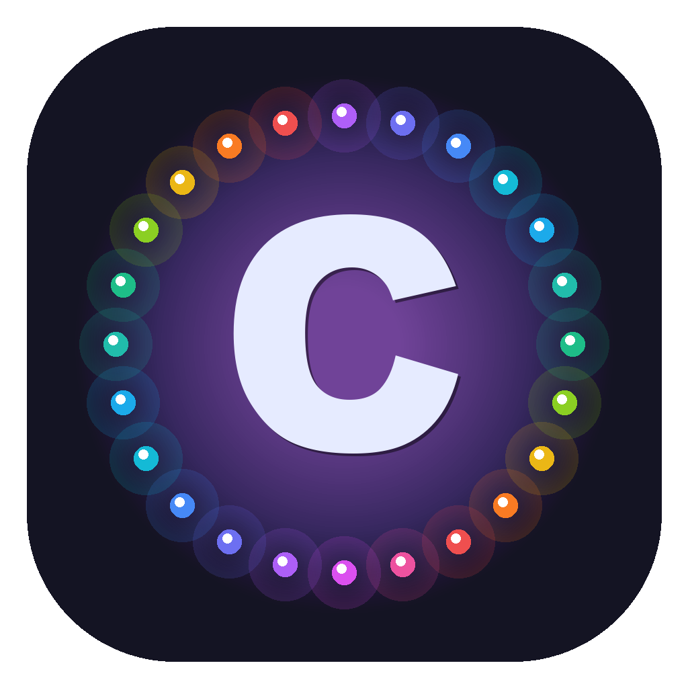

<div align="center">



# ✦ EdgeGlow

### **Make AI's Thinking Visible**

*When your AI agent codes, your screen glows.*

[中文](#中文) | [English](#english)

[](https://www.apple.com/macos)
[](LICENSE)
[]()
[]()
[]()
[]()

</div>

---

<a id="中文"></a>
## 🇨🇳 中文

### ✨ 为什么需要 EdgeGlow？

当你用 Claude Code / Hermes Agent 编程时，AI 在后台思考、读文件、执行命令——**但你看不到它是否在忙**。

EdgeGlow 让你的屏幕边缘亮起流光：

```
┌─────────────────────────────────────────┐
│  🔴 AI 正在思考    →  流光旋转流动      │
│  ⚫ 完成/等待输入   →  流光淡出消失      │
└─────────────────────────────────────────┘
```

> 从此，**AI 的工作状态一目了然**。余光一瞥，就知道该继续等待还是可以操作。

---

### 🎬 效果预览

<p align="center">
  
</p>

| 状态 | 视觉效果 | 触发方式 |
|:----:|:--------:|:--------:|
| 🟢 **思考中** | 流光沿屏幕边缘旋转流动 | `UserPromptSubmit` / `PreToolUse` |
| 🔴 **完成/等待** | 流光 1.5s 淡出消失 | `PostToolUse` / `Stop` |

---

### 📐 系统架构

```
                         ┌──────────────────────┐
                         │   AI Coding Agent    │
                         │  Claude Code / Hermes│
                         └──────────┬───────────┘
                                    │
                          curl HTTP (localhost)
                                    │
                    ┌───────────────┼───────────────┐
                    │               │               │
              /start │         /pulse │         /stop │
                    │               │               │
                    ▼               ▼               ▼
          ┌─────────────────────────────────────────────┐
          │              ControlServer                   │
          │     NWListener · 127.0.0.1:9876 · HTTP      │
          │     仅接受本地连接 · GET 方法验证             │
          └──────────────────┬──────────────────────────┘
                             │
                    onStart / onPulse / onStop
                             │
                             ▼
          ┌─────────────────────────────────────────────┐
          │               GlowWindow                     │
          │                                              │
          │  ┌──────────┐   ┌──────────────────────┐    │
          │  │ NSWindow │──▶│   ringLayer (CALayer) │    │
          │  │ borderless│   │                      │    │
          │  │ overlay   │   │  ┌────────────────┐  │    │
          │  │ 透明全屏  │   │  │ CAShapeLayer ×4│  │    │
          │  └──────────┘   │  │ (多层光效叠加)  │  │    │
          │                 │  │ 大光晕 · 中光晕 │  │    │
          │                 │  │ 主色线 · 亮芯   │  │    │
          │                 │  └────────────────┘  │    │
          │                 │                      │    │
          │                 │  Timer (60fps)       │    │
          │                 │  → lineDashPhase     │    │
          │                 │  → CAKeyframeAnim    │    │
          │                 │    (颜色循环)        │    │
          │                 └──────────────────────┘    │
          └─────────────────────────────────────────────┘
                             │
                    ┌────────┴────────┐
                    │   AppSettings   │
                    │  UserDefaults   │
                    │  Combine 响应式 │
                    └─────────────────┘
```

### 🔌 工作原理

```
AI Agent 执行操作
       │
       ▼
  触发 Hook（Claude Code / Hermes Agent 配置的事件）
       │
       ▼
  curl http://127.0.0.1:9876/{start|pulse|stop}
       │
       ▼
  ControlServer 解析 HTTP 请求
       │
       ▼
  GlowWindow 切换状态：
       ├── /start  → 重建图层 + 启动 Timer + 淡入
       ├── /pulse  → 停止 Timer + 保持静态显示
       └── /stop   → 停止 Timer + 淡出（1.5s）
```

### 🎨 四层光效渲染

```
                  屏幕边缘
                     │
    ┌────────────────┼────────────────┐
    │                │                │
    │   Layer 1      │  blur=12       │  大光晕 (最外层)
    │   ████████     │  width=1.5x    │  alpha=0.15
    │                │                │
    │   Layer 2      │  blur=8        │  中光晕
    │   ██████       │  width=0.8x    │  alpha=0.30
    │                │                │
    │   Layer 3      │  blur=2        │  主色线 (最亮)
    │   ████         │  width=0.3x    │  alpha=0.70
    │                │                │
    │   Layer 4      │  blur=0        │  亮芯 (最锐利)
    │   ██           │  width=0.1x    │  alpha=0.95
    │                │                │
    └────────────────┴────────────────┘
    
    每层独立运行 lineDashPhase 动画
    + CAKeyframeAnimation 颜色循环
    四层叠加 = 真实的霓虹光效
```

---

### 🚀 安装

> **系统要求：macOS 13.0 (Ventura) 及以上** · 支持 Intel & Apple Silicon

#### 方式一：下载 Release（推荐）

前往 [Releases](../../releases) 下载最新 `EdgeGlow-v1.0.0.zip`，解压后打开。

> ⚠️ 首次打开如遇「无法验证开发者」提示，请 **右键 → 打开** 即可。

#### 方式二：源码编译

```bash
git clone https://github.com/vector4wang/EdgeGlow.git
cd EdgeGlow

# 编译（自动构建 Universal Binary: arm64 + x86_64）
./build.sh

# 运行
open Build/EdgeGlow.app
```

---

### 🔌 配置 Agent 联动

EdgeGlow 通过 HTTP Hook 与 AI Agent 通信。你需要在 Agent 中配置对应的事件触发。

#### Claude Code

打开设置 → 点击「配置 Agent Hooks」→ 选择「Claude Code 查看配置」→ 复制引导词。

将引导词粘贴到 Claude Code 对话框中发送，Agent 会自动帮你完成 `~/.claude/settings.json` 的配置。

<details>
<summary>📋 手动配置参考</summary>

在 `~/.claude/settings.json` 中添加：

```json
{
  "hooks": {
    "UserPromptSubmit":  [{"hooks": [{"type": "command", "command": "curl -s http://127.0.0.1:9876/start"}]}],
    "PreToolUse":        [{"hooks": [{"type": "command", "command": "curl -s http://127.0.0.1:9876/start"}]}],
    "PostToolUse":       [{"hooks": [{"type": "command", "command": "curl -s http://127.0.0.1:9876/pulse"}]}],
    "PermissionRequest": [{"hooks": [{"type": "command", "command": "curl -s http://127.0.0.1:9876/pulse"}]}],
    "Stop":              [{"hooks": [{"type": "command", "command": "curl -s http://127.0.0.1:9876/stop"}]}]
  }
}
```

</details>

#### Hermes Agent

同样通过设置界面获取引导词，发给 Hermes Agent 即可。

<details>
<summary>📋 手动配置参考</summary>

在 `~/.hermes/agent-hooks/` 目录下创建脚本：

```bash
# pre_llm_call.sh
#!/bin/bash
curl -s http://127.0.0.1:9876/start

# pre_tool_call.sh
#!/bin/bash
curl -s http://127.0.0.1:9876/start

# post_tool_call.sh
#!/bin/bash
curl -s http://127.0.0.1:9876/pulse

# on_session_end.sh
#!/bin/bash
curl -s http://127.0.0.1:9876/stop
```

```bash
chmod +x ~/.hermes/agent-hooks/*.sh
```

</details>

---

### ⚙️ 设置

点击菜单栏 ✦ 图标 → 设置：

| 分类 | 设置项 | 说明 | 默认值 |
|:----:|:------:|:----:|:------:|
| 通用 | 启用流光 | 总开关，关闭后 Agent 不会触发流光 | ✅ ON |
| 通用 | 开机自启动 | 登录系统时自动启动 | ❌ OFF |
| 外观 | 颜色主题 | 4 种预设主题 | 🌈 炫酷 |
| 外观 | 速度 | 流光旋转速度 (1-10) | 5 |
| 外观 | 光带宽度 | 光效粗细 (1-10) | 5 |
| 外观 | 亮度 | 整体亮度 (0.3-1.0) | 0.85 |
| 外观 | 旋转方向 | 顺时针 / 逆时针 | 顺时针 |
| 高级 | HTTP 端口 | 控制服务端口 (1024-65535) | 9876 |
| 高级 | 配置 Agent Hooks | 查看引导词，复制发给 Agent | — |

#### 🎨 预设主题

| 主题 | 色系 | 适用场景 |
|:----:|:----:|:--------:|
| 🌈 炫酷 | 彩虹全色谱 | 日常使用，视觉冲击最强 |
| 🌊 柔和 | 低饱和蓝紫 | 夜间 / 长时间使用 |
| 🔥 烈焰 | 红橙黄暖色 | 热情满满地写代码 |
| ❄️ 冰雪 | 白蓝冷色 | 冷静思考，专注模式 |

---

### 📊 性能指标

| 指标 | 数值 | 说明 |
|:----:|:----:|:----:|
| CPU 占用 | **~0%** | Timer 60fps 仅更新一个 CGFloat 属性 |
| 内存占用 | **~50MB** | 4 层 CAShapeLayer + CIFilter |
| 启动时间 | **< 0.5s** | 无网络请求，纯本地运行 |
| 网络流量 | **0** | 仅监听 127.0.0.1，不对外通信 |

---

### ⚠️ 注意事项

1. **屏幕录制权限**：EdgeGlow 使用全屏透明覆盖窗口（`NSWindow.Level.overlayWindow`），部分 macOS 版本可能需要在「系统设置 → 隐私与安全 → 屏幕录制」中授权。

2. **多显示器**：自动适配所有屏幕的联合包围区域。插拔显示器时自动响应（500ms 延迟防抖）。

3. **端口冲突**：默认端口 `9876`，如被占用请在设置中更改。仅接受本地连接（`acceptLocalOnly`），不暴露到网络。

4. **Focus / 勿扰模式**：EdgeGlow 不会发送通知，不受勿扰模式影响。

5. **全屏应用**：当其他应用处于全屏模式时，EdgeGlow 不会覆盖全屏窗口（这是 macOS 的安全限制）。

6. **安全设计**：
   - HTTP 服务仅绑定 `127.0.0.1`，外部无法访问
   - 仅接受 `GET` 请求，拒绝 POST/PUT/DELETE
   - 无 CORS 头，网页 JavaScript 无法直接调用
   - 不收集任何用户数据，无遥测

---

### 🏗️ 源码结构

```
Sources/
├── main.swift              # 入口 · AppDelegate · 菜单栏
├── GlowWindow.swift        # 流光窗口 · 四层光效 · Timer 动画
├── ControlServer.swift     # HTTP 控制服务 · NWListener
├── HooksInstaller.swift    # Agent 配置引导（复制提示词模式）
├── L10n.swift              # 中英双语国际化
├── Settings/
│   ├── AppSettings.swift   # UserDefaults 持久化 · Combine 响应式
│   └── SettingsView.swift  # SwiftUI 设置界面
└── Themes/
    └── ColorTheme.swift    # 4 种预设颜色主题

Resources/
├── EdgeGlow.icns           # App 图标
├── menu_icon.png           # 菜单栏图标 (18×18 template)
├── Info.plist              # App 元数据
├── zfb.png                 # 支付宝收款码
└── wx.png                  # 微信收款码

build.sh                    # 构建脚本（Universal Binary + .app 打包）
```

**技术栈**：纯 Swift + Cocoa（NSWindow + CALayer + CAShapeLayer），无第三方依赖。

---

### 🔧 构建

```bash
# 构建 .app
./build.sh

# 打包 DMG
./build.sh dmg

# 签名（需要 Apple Developer ID）
./build.sh sign "Developer ID Application: Your Name"

# 公证 + 打包完整发布流程
./build.sh sign "Developer ID Application: Your Name" notarize dmg
```

---

### 📦 系统要求

- **macOS 13.0+ (Ventura)**
- 支持 Intel (x86_64) 和 Apple Silicon (arm64)
- Universal Binary，一个包通吃所有 Mac

---

<a id="english"></a>
## 🇺🇸 English

### ✨ Why EdgeGlow?

When using Claude Code or Hermes Agent, the AI works behind the scenes — **you can't tell if it's still thinking**.

EdgeGlow puts a glowing marquee around your screen edges:

- 🟢 **AI Thinking** → Marquee flows around the screen
- 🔴 **Done / Waiting** → Marquee fades out and disappears

> **One glance at your screen edge tells you everything.**

<p align="center">
  
</p>

### 🚀 Install

> **Requires macOS 13.0 (Ventura) or later** · Intel & Apple Silicon

Download `EdgeGlow-v1.0.0.zip` from [Releases](../../releases), unzip and open.

```bash
git clone https://github.com/vector4wang/EdgeGlow.git && cd EdgeGlow
./build.sh && open Build/EdgeGlow.app
```

### 🔌 Setup

Go to Settings → Configure Agent Hooks → copy the prompt → paste it into your AI agent's chat. The agent will configure the hooks automatically.

### ⚙️ Settings

Menu bar ✦ → Settings: color theme (4 presets), speed, width, brightness, direction, auto-start, HTTP port.

### ⚠️ Notes

- HTTP server binds to `127.0.0.1` only — not accessible from the network
- Only accepts GET requests
- No CORS headers — web JavaScript cannot invoke endpoints
- No data collection, no telemetry
- May require Screen Recording permission on some macOS versions

### 📦 Requirements

- **macOS 13.0+ (Ventura)**
- Intel (x86_64) and Apple Silicon (arm64)
- Universal Binary

---

## ☕ 赞助 / Donate

如果 EdgeGlow 对你有用，欢迎请作者喝杯咖啡 ☕

If EdgeGlow is useful to you, feel free to buy me a coffee ☕

| 支付宝 / Alipay | 微信支付 / WeChat Pay |
|:---:|:---:|
|  |  |

---

## 📄 License

MIT License. See [LICENSE](LICENSE) for details.

---

<div align="center">

**Made with ❤️ for AI-powered developers**

[⬆ Back to Top](#中文)

</div>
