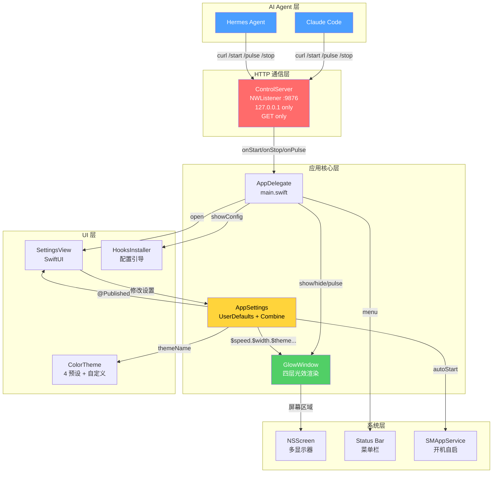
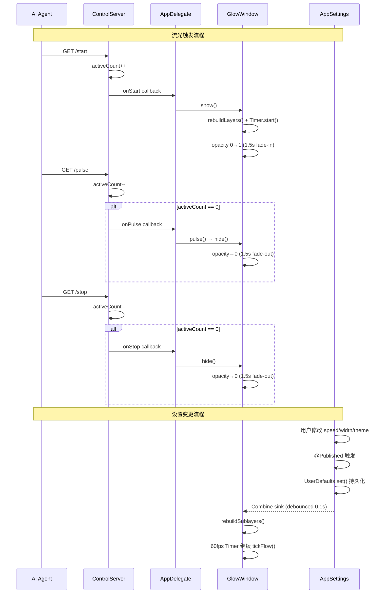
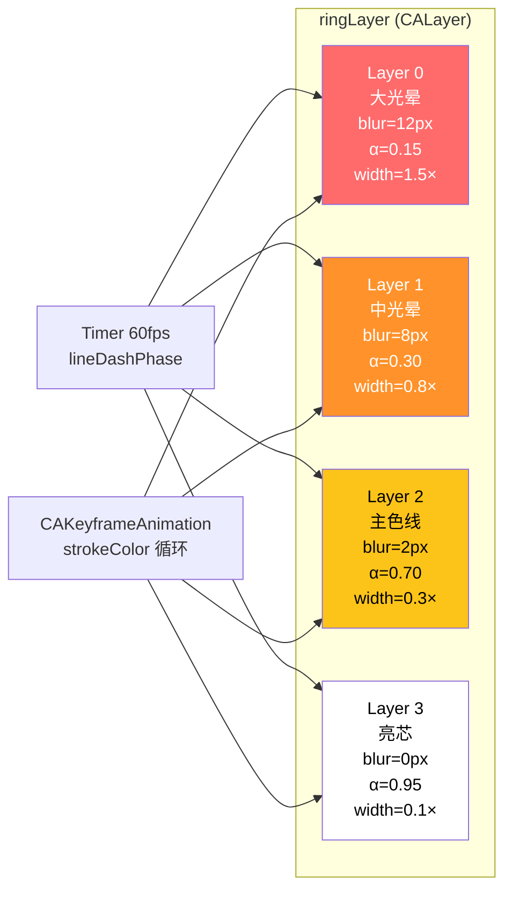
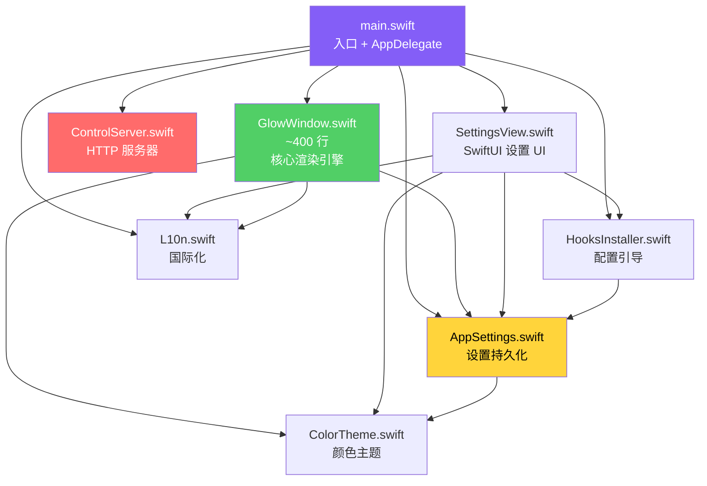

# EdgeGlow 架构分析报告

> 分析日期：2026-06-13
> 项目：claude-edge-glow-swift (EdgeGlow)
> 技术栈：Swift 5.9+ / macOS 12.0+ / 纯 Apple 框架 / 无第三方依赖

---

## 1. 系统架构图

---

## 2. 数据流图

---

## 3. 四层光效渲染架构

---

## 4. 组件依赖关系

---

## 5. 项目规模统计

| 文件 | 行数 | 职责 |
|------|------|------|
| GlowWindow.swift | ~400 | 核心渲染引擎（四层光效 + 动画 + 状态机） |
| ControlServer.swift | ~200 | HTTP 服务器（NWListener + 路由） |
| AppSettings.swift | ~200 | 设置管理（UserDefaults + Combine） |
| SettingsView.swift | ~250 | SwiftUI 设置界面 |
| main.swift | ~150 | 入口 + AppDelegate + 菜单栏 |
| HooksInstaller.swift | ~150 | Agent 配置引导 |
| ColorTheme.swift | ~100 | 颜色主题定义 |
| L10n.swift | ~80 | 中英双语国际化 |
| **合计** | **~1530** | **8 个源文件，零第三方依赖** |

---

## 6. 设计亮点

### 6.1 零依赖架构
- 纯 Swift + Apple 原生框架（Cocoa + Network + Combine + SwiftUI）
- 无 Package.swift 依赖，构建简单，编译快速

### 6.2 四层光效叠加
- 从外到内：模糊→锐利，暗淡→明亮
- 模拟真实霓虹灯的 bloom 效果
- 每层独立动画，产生深度感

### 6.3 引用计数防误灭
- ControlServer 的 `activeCount` 机制
- 多个 Agent 窗口同时工作时，只有全部停止才灭光
- 60s 安全定时器防止 Agent 崩溃后流光卡住

### 6.4 响应式设置传播
- AppSettings @Published → Combine sink → GlowWindow 自动重建
- 0.1s 防抖避免滑动条快速拖动时频繁重建
- 设置变更无需手动通知，数据流单向清晰

### 6.5 安全设计
- `acceptLocalOnly` 仅接受本地连接
- 仅 GET 方法，无请求体解析
- 无 CORS（OPTIONS 除外），网页 JS 无法调用
- 无数据收集，无遥测

---

## 7. 已识别问题

### 7.1 Bug 级别

| 问题 | 严重度 | 说明 |
|------|--------|------|
| `pulse()` 等同于 `hide()` | 中 | `/pulse` 应该产生"脉冲"效果（短暂闪亮），但当前只是淡出。PostToolUse 和 Stop 视觉效果完全相同 |
| `show()` 中 opacity 设置顺序 | 低 | 先设 model opacity=1.0 再添加从 0→1 的动画，如果 hide() 在 fade-in 期间被调用，读 model 层会得到错误值（但 presentation 层是正确的） |
| 隐藏状态下设置变更仍重建图层 | 低 | 不可见时 rebuildSublayers() 仍会销毁重建所有 CAShapeLayer，浪费 GPU 资源 |

### 7.2 性能优化建议

| 建议 | 影响 | 难度 |
|------|------|------|
| CIGaussianBlur 在 Retina 全屏下开销大 | 高 | 中 — 可考虑预渲染到位图或用多层透明度模拟 |
| 60fps Timer 持续运行即使静态 | 中 | 低 — 可在完全显示后降频到 30fps 或暂停 |
| `animationDuration * 3` 硬编码 | 低 | 低 — 可拆为独立设置项 |
| inset=2 硬编码出现在 3 处 | 低 | 低 — 提取为命名常量 |

### 7.3 功能增强建议

| 建议 | 说明 |
|------|------|
| 真正的 pulse 效果 | `/pulse` 时短暂闪亮（opacity 1.2× → 1.0）再恢复，而非直接 hide |
| 新 Agent 平台支持 | Cursor、Codex CLI、Windsurf 等也支持 hooks |
| 状态指示增强 | 除流光外，可考虑菜单栏图标也反映 AI 状态 |
| 多语言扩展 | L10n 硬编码字典方式不适合大规模扩展，可迁移到 .strings 文件 |
| 快捷键 | 为手动开/关、切换主题等添加全局快捷键 |

---

## 8. 安全审计

| 检查项 | 状态 | 说明 |
|--------|------|------|
| 网络暴露 | ✅ 安全 | 仅绑定 127.0.0.1，acceptLocalOnly |
| 请求验证 | ✅ 安全 | 仅接受 GET，拒绝 POST/PUT/DELETE |
| 输入解析 | ✅ 安全 | 只解析请求行，无 body 解析 |
| CORS | ⚠️ 注意 | OPTIONS 返回 `Access-Control-Allow-Origin: *`，但 GET 响应无 CORS 头 |
| 数据收集 | ✅ 安全 | 无遥测，无外部请求 |
| 权限要求 | ⚠️ 注意 | 需要屏幕录制权限（部分 macOS 版本） |
| 端口安全 | ✅ 安全 | 默认 9876，可配置，仅本地 |

---

## 9. 总结

EdgeGlow 是一个**架构清晰、实现精简**的 macOS 工具：

- **8 个源文件，~1530 行代码，零依赖**
- 核心渲染引擎（GlowWindow）是项目灵魂，四层光效 + 60fps 动画实现逼真霓虹效果
- HTTP 通信层简洁安全，引用计数设计合理
- 设置系统基于 Combine 响应式传播，数据流清晰
- 主要改进空间：pulse 效果、性能优化、更多 Agent 平台支持
